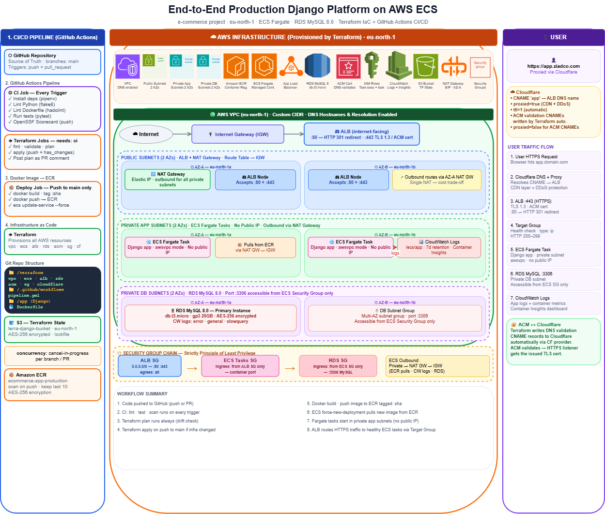
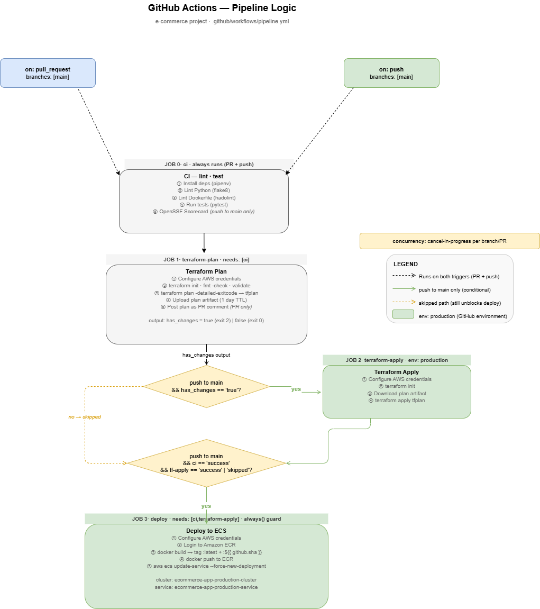

# Django E-Commerce API — Production Deployment on AWS ECS


A production-grade Django REST API deployed on AWS ECS Fargate with full infrastructure-as-code (Terraform), automated CI/CD (GitHub Actions), and network isolation across a 3-tier VPC.

---

## Architecture



**Traffic flow:** User → Cloudflare CDN → ALB (HTTPS/TLS 1.3) → ECS Fargate (private subnets) → RDS MySQL (isolated DB subnets)

### AWS Infrastructure

| Layer | Component | Details |
|---|---|---|
| DNS / CDN | Cloudflare | CNAME proxied → ALB, DDoS protection |
| Load Balancer | ALB | Internet-facing, HTTP→HTTPS redirect, TLS 1.3 |
| TLS | ACM | DNS-validated cert, CNAME written by Terraform |
| Compute | ECS Fargate | 2 tasks, 0.25 vCPU / 512 MB, private subnets, no public IPs |
| Database | RDS MySQL 8.0 | db.t3.micro, gp3 20 GB, AES-256 encrypted, DB-only subnets |
| Container Registry | ECR | Scan on push, lifecycle keeps last 10 images |
| Networking | VPC 10.0.0.0/16 | 3-tier subnets across 2 AZs (eu-north-1a/b) |
| IaC State | S3 | `terra-django-bucket`, encrypted, lockfile |

**Security group chain:** `ALB SG → ECS SG → RDS SG` (principle of least privilege — each layer only accepts traffic from the layer above it)

**Subnet tiers:**
- **Public** — ALB + NAT Gateway
- **Private-app** — ECS Fargate tasks
- **Private-db** — RDS MySQL (no route to internet)

---

## CI/CD Pipeline



5-job pipeline with per-branch concurrency cancellation (no queued stale deploys):

```
push/PR
  └─ CI (lint + test)                 ← always runs
       └─ Terraform Plan              ← always runs, posts plan to PR
            ├─ Terraform Apply        ← push to main + has_changes only
            └─ Deploy to ECS          ← push to main, after CI + terraform
```

**Key design decisions:**

- `terraform plan -detailed-exitcode` — exit 0 = no changes, exit 2 = has changes, exit 1 = error. Apply only runs when there's actually something to apply.
- `always()` on the deploy job — lets it proceed even when `terraform-apply` was skipped (no infra changes).
- Terraform plan posted as a collapsible PR comment; previous plan comments are deleted to keep PRs clean.

**Jobs:**

| Job | Trigger | What it does |
|---|---|---|
| `ci` | every push/PR | flake8, hadolint, pytest, OpenSSF Scorecard (main only) |
| `terraform-plan` | after CI | `terraform plan`, evaluates exit code, posts PR comment |
| `terraform-apply` | push to main + changes | Downloads plan artifact, applies |
| `deploy` | push to main, CI success | `docker build` → ECR push → ECS force-new-deployment |

---

## Tech Stack

**Application**
- Python 3.13, Django, Django REST Framework
- Djoser + SimpleJWT (authentication)
- Celery + Redis (async tasks)
- Gunicorn (WSGI server), WhiteNoise (static files)
- MySQL (production), SQLite (dev/test)

**Infrastructure**
- Terraform ~5.0 (AWS + Cloudflare providers)
- Docker (multi-stage build, non-root user)
- AWS: ECS Fargate, RDS, ALB, ACM, ECR, VPC, CloudWatch
- Cloudflare: DNS, CDN, DDoS protection

**CI/CD**
- GitHub Actions
- flake8 (Python linting), hadolint (Dockerfile linting)
- pytest (testing), OpenSSF Scorecard (supply chain security)

---

## Local Development

### Prerequisites

- Docker + Docker Compose
- Python 3.13 + pipenv

### Setup

```bash
git clone https://github.com/ZiadTamer77/e_commerce
cd e_commerce

# Install dependencies
pipenv install --dev

# Copy env file
cp .env.example .env   # fill in values (see Environment Variables below)

# Start services (app + MySQL + Redis)
docker compose up
```

The API will be available at `http://localhost:8000`.

### Running Tests

```bash
pipenv run pytest
```

### Linting

```bash
# Python
flake8 .

# Dockerfile
docker run --rm -i hadolint/hadolint < Dockerfile
```

---

## Environment Variables

| Variable | Description | Required |
|---|---|---|
| `SECRET_KEY` | Django secret key | Yes |
| `DB_HOST` | Database host | Yes |
| `DB_PORT` | Database port (default: 3306) | Yes |
| `DB_NAME` | Database name | Yes |
| `DB_USER` | Database user | Yes |
| `DB_PASSWORD` | Database password | Yes |
| `DJANGO_SUPERUSER_USERNAME` | Admin superuser name | Yes |
| `DJANGO_SUPERUSER_EMAIL` | Admin superuser email | Yes |
| `DJANGO_SUPERUSER_PASSWORD` | Admin superuser password | Yes |
| `DJANGO_SETTINGS_MODULE` | Settings module path | Yes |

**Terraform secrets** (set as GitHub Actions secrets):

| Secret | Description |
|---|---|
| `AWS_ACCESS_KEY_ID` / `AWS_SECRET_ACCESS_KEY` | AWS credentials |
| `TF_VAR_DB_PASSWORD` | RDS password |
| `TF_VAR_CLOUDFLARE_API_TOKEN` | Cloudflare API token |
| `TF_VAR_CLOUDFLARE_ZONE_ID` | Cloudflare zone ID |
| `TF_VAR_CLOUDFLARE_ACCOUNT_ID` | Cloudflare account ID |
| `TF_VAR_SECRET_KEY` | Django secret key |
| `TF_VAR_SUPERUSER_NAME/EMAIL/PASSWORD` | Django superuser credentials |

---

## API Endpoints

| Prefix | Description |
|---|---|
| `/store/` | Products, collections, carts, orders, customers, reviews |
| `/auth/` | Djoser user registration, login, profile management |
| `/auth/jwt/` | JWT token create, refresh, verify |
| `/admin/` | Django admin panel |
| `/playground/` | Dev sandbox (disabled in production) |

Authentication uses JWT bearer tokens. Obtain a token via `POST /auth/jwt/create/`.

---

## Terraform Deployment

```bash
cd terraform

# Initialize (downloads providers, configures S3 backend)
terraform init

# Preview changes
terraform plan

# Apply infrastructure
terraform apply
```

**Outputs after apply:**

| Output | Description |
|---|---|
| `application_url` | Live app URL (app.ziadco.com) |
| `alb_dns_name` | ALB DNS name |
| `ecr_repository_url` | ECR repo URL for image pushes |
| `ecs_cluster_name` | ECS cluster name |
| `ecs_service_name` | ECS service name |

> **Note:** The S3 backend (`terra-django-bucket`) must exist before running `terraform init`. Create it manually once before the first run.

---

## Project Structure

```
e_commerce/
├── .github/
│   └── workflows/
│       └── pipeline.yml        # CI/CD pipeline
├── terraform/
│   ├── vpc.tf                  # VPC, subnets, NAT, route tables
│   ├── ecs.tf                  # ECS cluster, task def, service, ECR
│   ├── alb.tf                  # ALB, target group, listeners
│   ├── rds.tf                  # RDS MySQL instance
│   ├── security-groups.tf      # SG chain: ALB → ECS → RDS
│   ├── acm.tf                  # ACM cert + DNS validation records
│   ├── cloudflare.tf           # Cloudflare DNS CNAME
│   ├── backend.tf              # S3 remote state
│   ├── variables.tf            # Input variables
│   └── outputs.tf              # Stack outputs
├── store/                      # Products, collections, carts, orders
├── core/                       # Custom user model, signals
├── likes/                      # Generic content likes
├── tags/                       # Generic content tagging
├── playground/                 # Dev sandbox
├── storefront/
│   ├── settings/
│   │   ├── common.py
│   │   ├── dev.py
│   │   ├── prod.py
│   │   └── test.py
│   └── urls.py
├── Dockerfile                  # Multi-stage build
├── docker-entrypoint.sh        # DB wait, migrate, collectstatic, gunicorn
├── Pipfile                     # Python dependencies
└── .hadolint.yaml              # Dockerfile lint config
```

---

## Live Demo

**URL:** https://app.ziadco.com

**GitHub:** https://github.com/ZiadTamer77
